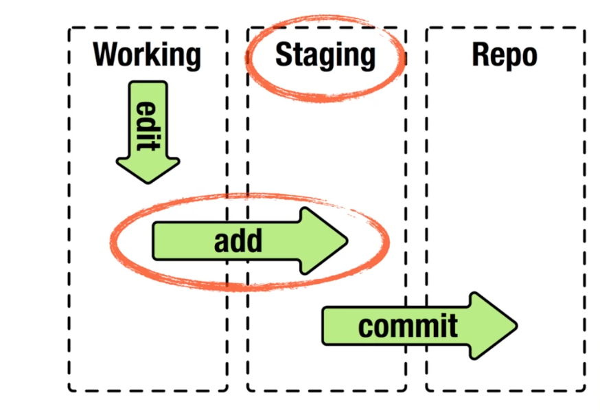

# Comandos Básicos

En este capítulo vamos a adentrarnos en los comandos básicos de Git y con los que podremos realizar la gran mayoria de tareas relacionadas con este control de versiones.

## ¿Cómo obtener un repositorio Git?

Básicamente tenemos dos opciones para poder tener un repositorio Git

### 👉🏻 Inicializarlo en un directorio existente

Aquí tenemos que tener en cuenta si el directorio está vacio o ya contiene archivos y carpetas:

- Si el directorio esta vacio basta con utilizar el comando:  
   **`git init`**
- Si el directorio ya cuenta con contenido y queremos rastrear el mismo:

```java
$ git add .
$ git commit -m"Primer commit"
```

### 👉🏻 Clonar un repositorio existente

Existen varios tipo de repositorios en la nube (_GitHub, GitLab, GitBucket_) tanto con proyectos públicos como privados. Desde los repositorios públicos se nos permite descargar a local una copia para poder trabajar en ellos, mediante el comando:

- **`git clone <URL> <miDirectorio>`** : Se clona a un directorio con el nombre que le he indicado.

  
  la diferencia entre clonar un proyecto o descargarlo en formato ZIP, es que clonado te traes todos los commits que se han realizado desde el comienzo.
  

## 🔁 Ciclo de vida de los archivos en Git

Dentro de este ciclo de vida podemos encontrarnos con tres estados en los que se pueden encontrar los archivos:

- **Working Area**: es el espacio donde se guardan los archivos y las carpetas sin rastrear.
- **Staged Area**: es la zona intermedia, un area de preparación donde están los archivos que han sido editados.
- **Repositorio**: es la zona donde se guardan todas las modificaciones y cambios realizados. Es el contenido de la carpeta oculta **`.git`**



- **`$ git status`**: permite conocer el estado de los archivos.
- **`$ git status -s`**: muestra el estado pero de una manera más reducida.
- **`$ git add <archivo1><archivo2><...>`**: comando que se utiliza para empezar a rastrear nuevos archivos.
- **`$ git add .`**: utilizando el punto añade todos los archivos a la vez.
- **`$ git diff`**: compara lo que tienes en el directorio de trabajo con lo que está en el área de preparación.
- **`$ git diff --staged`**: compara los cambios preparados con la última instantanea confirmada.
- **`$ git commit -m"Mensaje del commit"`**: comando que confirma los cambios y manda los archivos a la zona del Repositorio.
- **`$ git commit -a -m"Mensaje del commit`**: con esta combinación de comandos nos saltamos el area intermedia de preparación.
- **`$ git checkout <archivo>`**: devuelve un archivo que está en el Staged Area al Working Area. (deshace los cambios).

### ↪️ ¿Cómo deshacer cosas?

Es bastante corriente tener que deshacer algun cambio y vamos a ver algunas de las herramientas usadas para poder hacerlo:

- Como volver atrás cuando un archivo ya ha sido confirmado, por ejemplo para agregar algún archivo que se me haya podido olvidar en la conformación.

```java
$ git commit -m"Commit inicial"
$ git commit --amend
```


🚨 Puede que en el momento de deshacer esa commit se haya modificado alguno de los archivos que estaban incluidos en esa conformación.


- Como volver atrás cuando un archivo esta en el Staged Area (área de preparación) y quiero devolverlo al Working Area:

**`$ git reset HEAD <archivo>`**

- Como no mantener los cambios de un archivo que ha sido modificado, pero todavia no se ha añadido al Staged Area:

**`$ git checkout -- <archivo>`**


🚨 Este comando es peligroso, cualquier cambio realizado desaparecera.


### ✂ ¿Cómo eliminar un archivo?

- **`$ git rm <archivo>`**: elimina el archivo del directorio de trabajo, de manera que la próxima vez aparezca como un archivo no rastreado.
- **`$ git rm -f <archivo>`**: si el archivo ya había sido añadido al índice hay que forzar su eliminación.
- **`$ git rm --cached <archivo>`**: mantiene el archivo en el directorio de trabajo pero Git no lo rastreará.
- **`$ git rm log/\*.log`**: elimina todos los archivos con extensión `.log` dentro de la carpeta `log/`.
- **`$ git rm \*~`**: elimina todos los archivos que acaben con`~`.

### ✏️ ¿Cómo cambiar el nombre a un archivo?

- **`$ git mv <nombre> <nuevoNombre>`**: permite renombrar un archivo.
