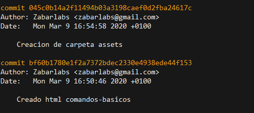
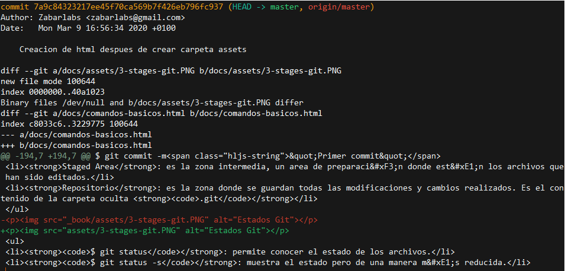
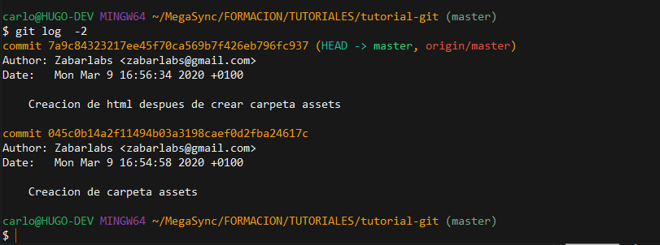
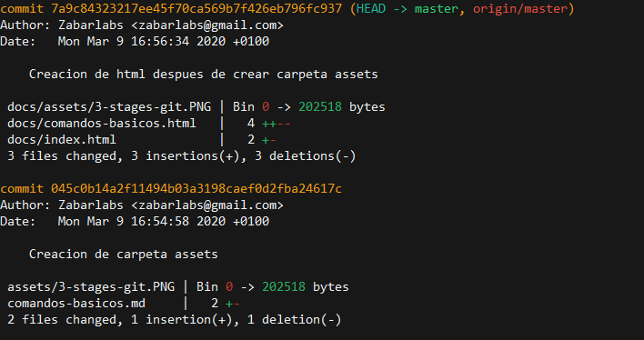
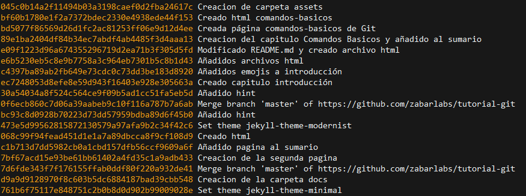
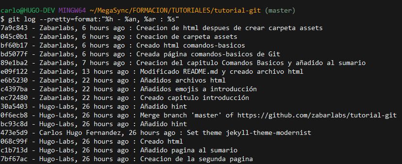
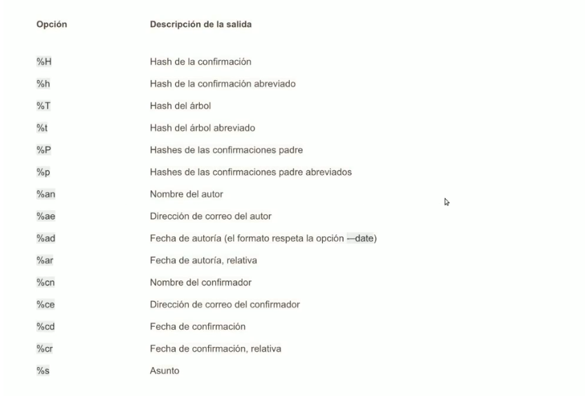
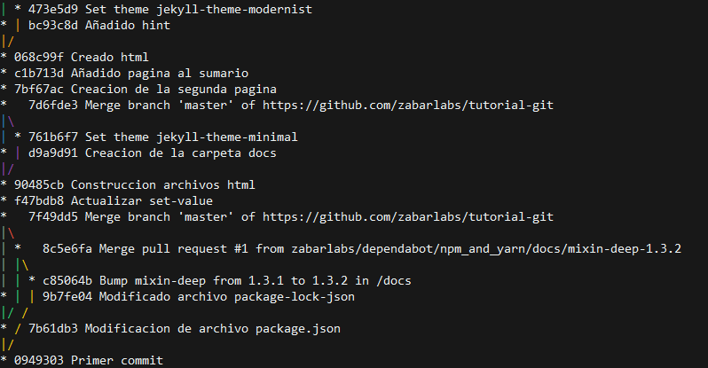

## 👓 Comprobar el historial de commits

A medida que va creciendo nuestro proyecto tendremos una línea de tiempo, donde cada punto de esa línea es un commit. El verdadero potencial de Git nos permite mirar hacia atrás y poder ver todas las modificaciones que hemos llevado a cabo.

- **`$ git log`**: nos muestra los commit realizados. Los parametros que nos presenta son el _hash largo, autor, fecha y mensaje del commit_.

- **`$ git log -p`**: muestra las diferencias introducidas en cada confirmación

- **`$ git log -2`**: muestra los dos último commits

- **`$ git log --stat`**: muestra una estadística de cada archivo y que paso.

- **`$ git log --pretty=oneline`**: `--pretty` permite modificar el formato de salida, puede presentar varias opciones, aquí `oneline`hace que se imprima cada commit en una sola línea.

- **`$ git log --pretty=format:"%h - %an, %ar : %s"`**: esta opción es interesante ya que permite especificar tu propio formato.

Aquí tenemos un cuadro con las diferentes valores que podemos introducir a `$ git log --pretty=format`:

- **`$ git log --pretty=format:"%h %s" --graph`**: la opción `--graph` añade un pequeño gráfico ASCII mostrando el historial de ramificaciones y uniones.

## 📌 Cuadro Resumen de Git Log

| Opcion            | Descripcion                                                           |
| :---------------- | :-------------------------------------------------------------------- |
| `-p`              | Muestra el parche introducido en cada confirmación                    |
| `--stat`          | Muestra estadísticas sobre los archivos modificados en cada commit    |
| `--shortstat`     | Muestra solamente la línea de resumen de la opción `--stat`           |
| `--name-only`     | Muestra la lista de archivos afectados                                |
| `--name-status`   | Muestra la lista de archivos afectados y su estado                    |
| `--abbrev-commit` | Muestra solo los primeros caracteres del hash                         |
| `--relative-date` | Muestra la fecha en formato relativo ("hace dos semanas")             |
| `--graph`         | Muestra un gráfico ASCII con el historias de ramificaciones y uniones |
| `--pretty`        | Muestra las confirmaciones utilizando un formato alternatico          |


Recordar que podemos realizar combinaciones entre las diferentes opciones.

